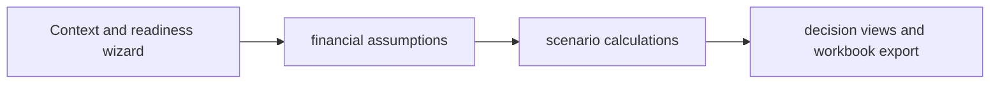

# AI ROI Modeler — Project Brief

## At a glance

| Field | Value |
|---|---|
| Portfolio area | Strategy and capital allocation |
| Repository | [jjshay/ai-roi-modeler](https://github.com/jjshay/ai-roi-modeler) |
| Status | Source available; runtime not revalidated in this documentation review |
| Evidence review | 2026-09-11; [commit 6c3ffbe](https://github.com/jjshay/ai-roi-modeler/tree/6c3ffbe765c49b701e602255851980669e7244cf) |

## Problem and intended value

AI investment decisions need transparent assumptions about adoption, operating costs, implementation, and financial returns.

The intended value is a repeatable workflow whose inputs, transformations, and outputs can be inspected. Use the evidence below to distinguish implementation from business outcomes.

## Architecture and data flow

Context and readiness wizard → financial assumptions → scenario calculations → decision views and workbook export.

## Implementation evidence

| Source | Reading purpose |
|---|---|
| [src/App.jsx](../src/App.jsx) | Application entry point, interface, or integration boundary. |
| [api/src/index.ts](../api/src/index.ts) | Application entry point, interface, or integration boundary. |

The links above point to the current repository. The review reference identifies the version used to prepare this brief.

## Setup and operation

Use the existing [README](../README.md) for setup and operating commands. Configuration and dependency references: [package.json](../package.json).

Start with sample or fixture inputs. Where external services are involved, configure a test account and check the distinction between a local preview, a generated artifact, and a remote write. Credentials and operational datasets are environment-specific.

## Validation and outcomes

**Review result:** Repository tree and referenced source reviewed. Existing application tests, hosted deployments, paid providers, and external mutations were not re-run in this documentation review.

No conventional test suite was identified in the reviewed repository tree; validation should begin with the next improvement below.

The source implements the workflow described above. No new revenue, accuracy, conversion, or production-uptime result is asserted by this documentation update.

Documentation itself is checked by `python3 scripts/check_project_docs.py`; that check validates this structure and its source references, not application behavior.

## Decisions and limitations

Formula transparency helps decision review; outputs remain conditional on assumptions and do not establish realized savings.

Keep provider-dependent observations dated and separate from deterministic transformations. State which assumptions a demonstration uses and which integrations it actually exercises.

## Interview talking points

- **Problem and product judgment:** Explain why this workflow mattered to its intended operator: AI investment decisions need transparent assumptions about adoption, operating costs, implementation, and financial returns.
- **Technical walkthrough:** Trace one concrete input through this sequence: Context and readiness wizard → financial assumptions → scenario calculations → decision views and workbook export.
- **Engineering tradeoff:** Formula transparency helps decision review; outputs remain conditional on assumptions and do not establish realized savings.
- **Evidence and ownership:** Open the source links above, identify the specific design or implementation decisions you personally drove, and distinguish AI-assisted implementation from measured operating results.
- **What comes next:** Validate financial formulas with independently calculated fixtures and reconcile a pilot's actual costs and benefits against the original case.

## Next improvements

Validate financial formulas with independently calculated fixtures and reconcile a pilot's actual costs and benefits against the original case.

Record any follow-up result with a date, exact command or evaluation method, input scope, observed output, and limitations. Update `project.json` alongside this brief.

## Related projects

- [Global Gauntlet Advisory Site Kit](https://github.com/jjshay/global-gauntlet-site-kit) — Strategy and capital allocation.
- [AI M&A Valuation Model](https://github.com/jjshay/ai-mna-model) — Strategy and capital allocation.

Some related repositories require authorized GitHub access.
